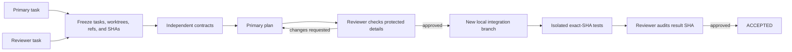

# Worktree Merge Consensus

[](https://github.com/Zita-Go/worktree-merge-consensus/actions/workflows/ci.yml)
[](https://github.com/Zita-Go/worktree-merge-consensus/releases)
[](LICENSE)


[简体中文](README.zh-CN.md)

> Git can merge diffs. This tool makes two Codex tasks reconcile intent.

Turn two committed Codex worktrees into one tested and reviewed **new local
integration branch**. Neither source branch is modified, and nothing is pushed.


**Real Codex acceptance demo:**

https://github.com/user-attachments/assets/d9c0341f-83ed-4d12-9be1-42479e4c5d45

**Input:** two existing Codex tasks and two clean, committed worktrees in one
repository.

**Output:** a new `consensus/<run-id>` branch approved for an exact commit SHA,
with isolated test evidence and unchanged source refs.

> [!IMPORTANT]
> This project uses the experimental Codex App Server protocol and currently
> ships as a pre-release. Participant turns are unattended and use
> `dangerFullAccess`. Use it only with tasks and repository contents you trust.

## Why this exists

Two Codex tasks can implement related changes in separate worktrees while each
task retains important reasoning in its own conversation history. A plain Git
merge sees the resulting files, but it cannot ask whether either task's behavior,
constraints, tests, or protected implementation details were lost.

Worktree Merge Consensus coordinates that missing review:

- the **Primary** proposes how both implementations should be preserved;
- the **Reviewer** checks the proposal against its own task history;
- they iterate until the Reviewer approves an exact plan revision;
- only then does the Primary integrate on a unique new local branch;
- the coordinator tests the exact result SHA in an isolated, remote-free clone;
- the Reviewer approves or rejects that exact tested SHA.

The two tasks do not receive each other's complete transcripts or hidden
reasoning. Each task keeps its own context, while the coordinator exchanges only
bounded contracts, plans, review feedback, result summaries, and verdicts.

## What you see in Codex

The task that launches the workflow follows the durable public event stream and
shows meaningful progress rather than a spinner:

```text
[1/6 SOURCE_FREEZE] Frozen both source refs and worktrees
[2/6 CONTRACT]      Both tasks declared behavior, constraints, and tests
[3/6 PLAN_REVIEW]   Reviewer requested one missing compatibility case
[3/6 PLAN_REVIEW]   Primary revised the plan; Reviewer approved revision 2
[4/6 INTEGRATE]     Created consensus/7b1... at 4e20c6a
[5/6 VERIFY]        3/3 frozen commands passed on the exact detached SHA
[6/6 RESULT_REVIEW] Reviewer approved 4e20c6a
[6/6 ACCEPTED]      Source refs unchanged; local branch retained; no push
```

`consensus_wait` supports a resumable `after_cursor`, so launcher observation
can continue after interruption. The public stream excludes hidden reasoning,
participant prompts, raw task history, and command stdout/stderr.

## Quick start

### Requirements

- Linux x86_64 or ARM64.
- Git and Codex CLI `>=0.144.1` in `PATH`.
- Two existing Codex tasks under the same local account and host.
- Two different registered worktrees in the same Git common directory.
- Both implementations committed and both source worktrees clean.

This is a **same-host** workflow. Cross-machine and cross-account coordination
are not supported.

### 1. Install the release binary

Download the static musl binary, plugin bundle, and `SHA256SUMS` from the same
[GitHub Release](https://github.com/Zita-Go/worktree-merge-consensus/releases).
Choose `x86_64-unknown-linux-musl` or `aarch64-unknown-linux-musl` for your host.

```bash
VERSION=0.3.8
TARGET=x86_64-unknown-linux-musl
BASE_URL="https://github.com/Zita-Go/worktree-merge-consensus/releases/download/v${VERSION}"

curl -fLO "${BASE_URL}/SHA256SUMS"
curl -fLO "${BASE_URL}/codex-consensus-v${VERSION}-${TARGET}.tar.gz"
curl -fLO "${BASE_URL}/worktree-merge-consensus-plugin-v${VERSION}.tar.gz"
sha256sum --ignore-missing --check SHA256SUMS

tar -xzf "codex-consensus-v${VERSION}-${TARGET}.tar.gz"
mkdir -p "$HOME/.local/bin"
install -m 0755 \
  "codex-consensus-v${VERSION}-${TARGET}/codex-consensus" \
  "$HOME/.local/bin/codex-consensus"
export PATH="$HOME/.local/bin:$PATH"
```

The released binaries are static and do not require a particular host GLIBC.
To build from source instead, install Rust 1.85 or newer and run:

```bash
cargo install --locked --path crates/cli
```

### 2. Install the Codex plugin

The binary/plugin artifacts must have the same version. Extract the plugin and
register the directory containing `.agents/plugins/marketplace.json`:

```bash
tar -xzf "worktree-merge-consensus-plugin-v${VERSION}.tar.gz"
codex plugin marketplace add \
  "$PWD/worktree-merge-consensus-plugin-v${VERSION}"
codex plugin add worktree-merge-consensus@worktree-merge-consensus
codex-consensus configure
codex-consensus doctor
```

`codex-consensus configure` writes and verifies only the request-bound patch
approval key:

```text
plugins.worktree-merge-consensus.mcp_servers.worktreeMergeConsensus.tools.consensus_apply_patch.approval_mode = "approve"
```

It does not weaken global command or approval policy. Open a new Codex task after
installation or upgrade so the plugin tool surface is freshly loaded.

### 3. Launch from Codex

In the new launcher task, invoke:

```text
$worktree-merge-consensus:worktree-merge-consensus
```

The launcher lists local tasks and registered worktrees, asks you to confirm the
Primary/Reviewer mapping, starts the persistent coordinator, and displays the
review rounds and final result in the same task.

For a disposable walkthrough, see [Quick demo](docs/quick-demo.md).

## How it works



The coordinator freezes both task IDs, selected worktree paths, source refs, and
commit SHAs before review. Task selection and worktree selection are independent:
a task cwd is display metadata only and is never trusted as source identity.

The participant protocol is `worktree-merge-consensus/v2`. Every participant
response uses one `<consensus-result>...</consensus-result>` marker. Contracts
contain one JSON body so exact test commands are machine-readable; plans,
feedback, integration summaries, and final reviews remain ordinary Markdown.
See the [v2 protocol](docs/protocol-v2.md) for the exact contract.

<details>
<summary>Advanced: Primary task binding</summary>

Before the first Primary action, the frozen selected task becomes the **Source
Primary**. A `notLoaded` task is loaded with the participant configuration and
binds directly as the **Effective Primary**. A preloaded Source Primary without
the exact participant tool is represented by an `ephemeral: true` full-history
`thread/fork`; the mirror carries no active goal and is read with
`includeTurns: false`. Before every Primary turn, the coordinator paginates
`mcpServerStatus/list` before `turn/start` and requires exactly the participant
tool `consensus_apply_patch`. Reviewer routing remains unchanged. A pending or
uncertain turn is never reforked or resent.

</details>

## Safety boundaries

- The result always stops on a unique new local integration branch.
- Both frozen source refs and SHAs are revalidated throughout the Run.
- The coordinator has no push, PR, source-ref update, rebase, reset, deletion,
  credential-management, or worktree-cleanup capability: this is a **no-push**
  contract.
- Only the Primary may write the integration result. The Reviewer is read-only.
- Verification uses App Server `command/exec` in a clean detached clone of the
  exact integration SHA with no remote. A model's statement that tests passed is
  not evidence.
- Coordinator-started turns use approval policy `never` and sandbox policy
  `dangerFullAccess`, so trusted tasks and trusted repository contents are a
  hard requirement.
- The request-bound `consensus_apply_patch` tool accepts at most one validated,
  text-only patch for the exact active request. It is not a public CLI command.
- Installation or enablement alone never mutates or recovers an existing Run.

Read the [safety model](docs/safety-model.md) and [security policy](SECURITY.md)
before using the tool on valuable repositories.

## CLI

The plugin is the easiest interface, but every operator action also has a CLI:

| Purpose | Command |
| --- | --- |
| Configure the one request-bound tool | `codex-consensus configure` |
| Diagnose the environment | `codex-consensus doctor` |
| List Codex tasks | `codex-consensus threads list` |
| List registered source worktrees | `codex-consensus worktrees list --repository /repo --json` |
| Start interactively | `codex-consensus run` |
| Inspect one Run | `codex-consensus status RUN_ID` |
| Follow public progress | `codex-consensus watch RUN_ID` |
| Resume after a resolved pause | `codex-consensus resume RUN_ID` |
| Cancel while preserving Git state | `codex-consensus cancel RUN_ID` |

Scripted start requires both task IDs and both explicit worktree paths:

```bash
codex-consensus run \
  --primary-thread THREAD_ID_A \
  --primary-worktree /repo/.worktrees/change-a \
  --reviewer-thread THREAD_ID_B \
  --reviewer-worktree /repo/.worktrees/change-b \
  --integration-branch consensus/my-integration \
  --test "cargo test --workspace" \
  --json
```

Every `--test` is a frozen direct command. Git commands, shell control
operators, and dynamic shell/interpreter launchers are rejected. Use a committed
test script for composed checks.

MCP names such as `consensus_list_worktrees`, `consensus_wait`, and
`consensus_apply_patch` are tools, not shell executables. Do not run
`command -v consensus_doctor`; the terminal diagnostic is
`codex-consensus doctor`.

## Status and recovery

| Status | Meaning |
| --- | --- |
| `RUNNING` | The daemon can dispatch the next deterministic step. |
| `WAITING_THREAD` | A selected task already has an active turn. |
| `PAUSED_USER_ACTION` | Resolve the displayed condition, then explicitly resume. |
| `ACCEPTED` | Tests and Reviewer approval match the exact result SHA. |
| `BLOCKED` | A protocol, safety, round-limit, or no-progress condition stopped the Run. |
| `CANCELLED` | Cancellation preserved all existing Git state. |
| `INCOMPATIBLE_CODEX` | The local App Server adapter is unsupported or incomplete. |

Recovery is always explicit and same-Run. It revalidates frozen identities and
never silently creates a replacement Run or repeats an uncertain write. See
[Recovery and troubleshooting](docs/recovery.md) for the reason-by-reason guide.

Common installation diagnostics:

- `LEGACY_SKILL_CONFLICT`: an older manually installed skill shadows the plugin;
  back it up or remove it manually, reinstall matching binary/plugin versions,
  and open a new task.
- `APPROVAL_CONFIGURATION_REQUIRED`: run `codex-consensus configure` as the same
  account and `CODEX_HOME` used by Codex. Do not enable global auto-approval.
- Missing `consensus_*` tools: run `codex mcp list --json`; a successful CLI
  doctor does not prove that an already-open task loaded the plugin.

## Documentation

- [Quick demo](docs/quick-demo.md)
- [Safety model](docs/safety-model.md)
- [Recovery and troubleshooting](docs/recovery.md)
- [Compatibility policy](docs/compatibility.md)
- [Participant protocol v2](docs/protocol-v2.md)
- [Legacy protocol v1](docs/protocol-v1.md)
- [Real-Codex qualification record](docs/real-codex-smoke-test.md)
- [Changelog](CHANGELOG.md)
- [Contributing](CONTRIBUTING.md)

## Project status

Releases remain pre-release until the real-Codex qualification record is
completed with reproducible, redacted evidence. Automated tests use a
process-level fake App Server and extensive disposable Git fixtures; they do not
replace a recorded real-Codex acceptance Run.

This is a community project and is not an official OpenAI product.

Licensed under [Apache License 2.0](LICENSE).
