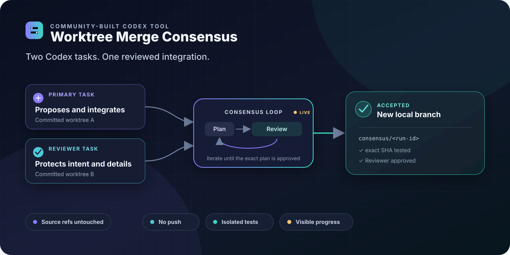
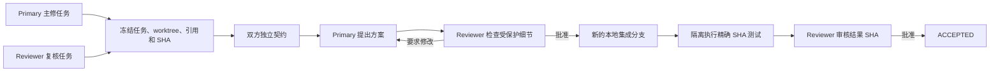

# Worktree Merge Consensus

[](https://github.com/Zita-Go/worktree-merge-consensus/actions/workflows/ci.yml)
[](https://github.com/Zita-Go/worktree-merge-consensus/releases)
[](LICENSE)


[English](README.md)

> Git 保存“改了什么”；原开发任务记得“为什么这样改”。

Codex 并行开发会留下两类资产：

- commit 保存最终代码；
- 原开发任务的会话历史保存设计意图、约束、权衡、测试要求，以及不能丢失的实现细节。

普通 Git merge 只使用第一类信息。文本没有冲突，并不代表实现意图没有冲突：某项行为仍可能
被覆盖，两份单独正确的修改也可能被错误地组合。真正出现文件冲突时，一个后来接手的合并任务
虽然能看到冲突位置，却可能只能猜测双方为什么这样实现。

Worktree Merge Consensus 让两个原开发任务继续参与集成。Primary 提出方案，Reviewer 使用
自己的原始会话上下文检查行为、约束和受保护细节，双方在任何集成写入发生之前持续修订方案；
随后协调器测试精确结果 SHA，Reviewer 再对该结果进行最终验收。

它不会在任务之间复制完整会话全文或隐藏推理。每个任务保留并使用自己的上下文，协调器只交换
复核所需的契约、方案、反馈、摘要、证据和结论。

| 普通 Git merge | Worktree Merge Consensus |
| --- | --- |
| 只看到代码差异 | 原开发任务继续用各自上下文参与复核 |
| 文本无冲突时可能隐藏语义遗漏 | Reviewer 检查行为、约束和受保护细节 |
| 单个合并者根据文件猜测冲突意图 | Primary 提案，Reviewer 根据原始上下文质询 |
| 文件组合完成即结束 | 测试并复核精确集成 SHA |

最终输出是一个经过测试和复核的**新本地集成分支**。两个来源分支都不会被修改，也不会发生
push。



**真实 Codex 验收演示：**

https://github.com/user-attachments/assets/d9c0341f-83ed-4d12-9be1-42479e4c5d45

**输入：** 同一仓库中的两个已有 Codex 任务，以及两个干净、已经提交的 worktree。

**输出：** 新的 `consensus/<run-id>` 分支；Reviewer 针对精确 commit SHA 验收，
协调器保存隔离测试证据，并确认两个来源引用没有变化。

> [!IMPORTANT]
> 本项目使用实验性的 Codex App Server 协议。0.3.15 已通过有记录的真实 Codex 验收，但参与
> 任务仍以无人值守的 `dangerFullAccess` 运行。只能用于你信任的任务和仓库内容。

## 上下文如何参与集成

协调器不会把两份 commit 当成没有背景的信息，而是让两个原开发任务成为集成过程中的主动
复核者：

- **Primary（主修）**提出如何保留双方实现的方案；
- **Reviewer（复核）**根据自己的任务历史检查方案；
- 双方持续迭代，直到 Reviewer 认可一个精确方案版本；
- 只有此时 Primary 才能在唯一的新本地分支上实施集成；
- 协调器在 detached、无 remote 的隔离克隆中测试精确结果 SHA；
- Reviewer 最终只批准或拒绝这个经过测试的 SHA。

两个任务不会互相获得完整会话全文或隐藏推理。它们各自保留原有上下文；协调器只交换经过
限制的契约、方案、复核意见、结果摘要和结论。

## 在 Codex 中能看到什么

启动流程的 Codex 任务会持续展示有意义的公开进度，而不是只显示一个等待动画：

```text
[1/6 SOURCE_FREEZE] 冻结双方来源引用与 worktree
[2/6 CONTRACT]      双方分别声明行为、约束与测试
[3/6 PLAN_REVIEW]   Reviewer 指出一个遗漏的兼容场景
[3/6 PLAN_REVIEW]   Primary 修订方案，Reviewer 批准第 2 版
[4/6 INTEGRATE]     创建 consensus/7b1...，结果为 4e20c6a
[5/6 VERIFY]        3/3 条冻结命令在精确 detached SHA 上通过
[6/6 RESULT_REVIEW] Reviewer 批准 4e20c6a
[6/6 ACCEPTED]      来源引用未变；保留本地分支；没有 push
```

`consensus_wait` 使用可恢复的 `after_cursor`；即使启动任务的观察中断，也能从已有游标继续。
公开事件流不会包含隐藏推理、参与任务提示词、原始任务历史或命令 stdout/stderr。

## 快速开始

### 前置条件

- Linux x86_64 或 ARM64。
- `PATH` 中可以使用 Git 和 Codex CLI `>=0.144.1`。
- 首次启动可使用 `curl` 或 `wget`、`tar`，以及 `sha256sum` 或 `shasum`。
- 同一本地账号、同一主机上的两个已有 Codex 任务。
- 同一 Git common directory 中两个不同的已注册 worktree。
- 两个实现都已经提交，两个来源 worktree 都是干净的。

这是一个 **same-host** 流程，不支持跨机器或跨账号协调。

### 1. 直接从 Codex marketplace 安装

注册 GitHub 仓库并安装插件。Codex 会自行下载 marketplace 快照，不再需要人工下载、解压
发布包。

```bash
codex plugin marketplace add Zita-Go/worktree-merge-consensus
codex plugin add worktree-merge-consensus@worktree-merge-consensus
```

注册 marketplace 后，也可以在 Codex 中打开 `/plugins`，选择
**Worktree Merge Consensus**，再点击 **Install**。

在第一个新的 Codex 任务中，插件会自动识别
`x86_64-unknown-linux-musl` 或 `aarch64-unknown-linux-musl`，从同版本
[GitHub Release](https://github.com/Zita-Go/worktree-merge-consensus/releases)
下载对应静态二进制，核验其 `SHA256SUMS` 条目，并缓存到私有 `PLUGIN_DATA`。MCP 首次启动
为慢速或代理下载预留五分钟，后续任务直接复用已验证缓存。binary/plugin 版本保持锁定。

随后 `consensus_doctor` 会验证运行环境，并在缺失时只配置下面这一项审批：

```text
plugins.worktree-merge-consensus.mcp_servers.worktreeMergeConsensus.tools.consensus_apply_patch.approval_mode = "approve"
```

它不会放宽全局命令或审批策略。安装或升级后请新建 Codex 任务，让完整插件工具面重新加载。

离线或集中运维环境可以自行安装同版本发布二进制，并通过绝对路径
`CODEX_CONSENSUS_BIN` 指定。如果希望从源码构建，请安装 Rust 1.85 或更高版本，然后运行：

```bash
cargo install --locked --path crates/cli
codex-consensus configure
codex-consensus doctor
```

### 2. 在 Codex 中启动

在新的启动任务中调用：

```text
$worktree-merge-consensus:worktree-merge-consensus
```

启动器会列出本机任务和已注册 worktree，请你确认 Primary/Reviewer 映射，然后启动持久协调器，
并在同一个任务中展示复核轮次和最终结果。

如果想先在一次性仓库中体验，请阅读[快速演示](docs/quick-demo.zh-CN.md)。

## 工作方式



协调器在复核开始前冻结两个任务 ID、选定 worktree 路径、来源引用和 commit SHA。任务选择与
worktree 选择互相独立：task cwd 只用于界面展示，绝不会被当作来源身份。

参与协议是 `worktree-merge-consensus/v2`。每次参与任务回复只使用一个
`<consensus-result>...</consensus-result>` 标记。契约保留一个 JSON 正文，以便提取精确测试
命令；方案、反馈、集成摘要和最终复核都使用普通 Markdown。精确规则见
[v2 协议](docs/protocol-v2.md)。

<details>
<summary>高级说明：Primary 任务绑定</summary>

在第一个主修动作之前，用户选定的冻结任务成为 **Source Primary**。处于 `notLoaded` 的
Source Primary 会加载参与配置，并直接绑定为 **Effective Primary**。已加载但缺少精确参与
工具的 Source Primary 会由一个 `ephemeral: true` 的完整历史 `thread/fork` 镜像代表；镜像
不会继承活动 goal，并且只用 `includeTurns: false` 读取。每次 Primary turn 之前，协调器都会
在 `turn/start` 前分页读取 `mcpServerStatus/list`，并要求参与工具面精确只有
`consensus_apply_patch`。Reviewer 路由保持不变；pending 或 uncertain turn 不会重新 fork
（refork），也不会重发（resent）。

</details>

## 安全边界

- 结果只停在唯一的新本地集成分支。
- 整个 Run 会持续复验两个冻结来源引用和 SHA。
- 协调器没有 push、创建 PR、更新来源引用、rebase、reset、删除、凭据管理或清理 worktree
  的能力；这是明确的 **no-push** 契约。
- 只有 Primary 可以写入集成结果，Reviewer 只读。
- 验证通过 App Server `command/exec` 在精确结果 SHA 的干净 detached、无 remote 克隆中执行；
  模型自行声称测试通过不构成证据。
- 协调器启动的 turn 使用审批策略 `never` 和 sandbox 策略 `dangerFullAccess`，所以必须信任
  选定任务和仓库内容。
- 绑定请求的 `consensus_apply_patch` 最多接受一个经过验证、对应精确活动请求的纯文本补丁；
  它不是公开 CLI 命令。
- 仅安装或启用插件绝不会修改或恢复已有 Run。

在重要仓库中使用前，请阅读[安全模型](docs/safety-model.zh-CN.md)和
[安全策略](SECURITY.md)。

## CLI

插件是最简单的入口，但所有操作者动作也都有 CLI：

| 用途 | 命令 |
| --- | --- |
| 配置唯一的绑定请求工具 | `codex-consensus configure` |
| 环境诊断 | `codex-consensus doctor` |
| 列出 Codex 任务 | `codex-consensus threads list` |
| 列出已注册来源 worktree | `codex-consensus worktrees list --repository /repo --json` |
| 交互启动 | `codex-consensus run` |
| 查看一个 Run | `codex-consensus status RUN_ID` |
| 跟随公开进度 | `codex-consensus watch RUN_ID` |
| 解决暂停原因后恢复 | `codex-consensus resume RUN_ID` |
| 保留 Git 状态并取消 | `codex-consensus cancel RUN_ID` |

脚本启动时必须同时提供两个任务 ID 和两个明确 worktree 路径：

```bash
codex-consensus run \
  --primary-thread THREAD_ID_A \
  --primary-worktree /repo/.worktrees/change-a \
  --reviewer-thread THREAD_ID_B \
  --reviewer-worktree /repo/.worktrees/change-b \
  --integration-branch consensus/my-integration \
  --test "cargo test --workspace" \
  --json
```

每个 `--test` 都是冻结的直接命令。Git 命令、shell 控制符和动态 shell/解释器启动器都会被拒绝；
需要组合检查时，应直接调用仓库中已经提交的测试脚本。

`consensus_list_worktrees`、`consensus_wait`、`consensus_apply_patch` 等名称是 MCP 工具，不是
shell 可执行文件。不要运行 `command -v consensus_doctor`；终端诊断命令是
`codex-consensus doctor`。

## 状态与恢复

| 状态 | 含义 |
| --- | --- |
| `RUNNING` | daemon 可以发送下一个确定性步骤。 |
| `WAITING_THREAD` | 选中的任务已经有进行中的 turn。 |
| `PAUSED_USER_ACTION` | 先解决界面显示的条件，然后显式恢复。 |
| `ACCEPTED` | 测试和 Reviewer 批准都对应精确结果 SHA。 |
| `BLOCKED` | 协议、安全、轮次上限或无进展条件终止了 Run。 |
| `CANCELLED` | 取消操作保留全部已有 Git 状态。 |
| `INCOMPATIBLE_CODEX` | 本地 App Server 适配器不受支持或缺少必要能力。 |

恢复始终是显式的同一 Run 恢复。协调器会重新验证冻结身份，不会暗中创建替代 Run，也不会重复
任何结果不确定的写操作。按原因处理的方法见[恢复与故障排查](docs/recovery.zh-CN.md)。

常见安装诊断：

- `LEGACY_SKILL_CONFLICT`：旧的手动安装 Skill 覆盖了插件；请自行备份或移除旧 Skill，重新
  安装版本匹配的 binary/plugin marketplace 发布版，并新建任务。
- `APPROVAL_CONFIGURATION_REQUIRED`：插件通常会自动修复唯一的作用域键；若被托管策略阻止，
  使用与 Codex 相同的账号和 `CODEX_HOME` 运行 `codex-consensus configure`，不要启用全局自动审批。
- 缺少 `consensus_*` 工具：运行 `codex mcp list --json` 并检查 MCP 启动诊断；直接 CLI doctor
  成功不代表一个已经打开的旧任务加载了插件。

## 文档

- [快速演示](docs/quick-demo.zh-CN.md)
- [安全模型](docs/safety-model.zh-CN.md)
- [恢复与故障排查](docs/recovery.zh-CN.md)
- [兼容策略](docs/compatibility.md)
- [参与协议 v2](docs/protocol-v2.md)
- [旧参与协议 v1](docs/protocol-v1.md)
- [真实 Codex 验收记录](docs/real-codex-smoke-test.md)
- [版本记录](CHANGELOG.md)
- [贡献指南](CONTRIBUTING.md)

## 项目状态

本版本（0.3.15）已完成[真实 Codex 验收记录](docs/real-codex-smoke-test.md)：两个已有任务达成共识，
Reviewer 要求修正语义问题，6 条冻结命令在最终精确 SHA 上通过，两个来源引用保持不变且没有
push。“稳定发布”描述的是本项目的发布门槛；上游 App Server 依赖仍属于实验性接口。

这是一个社区项目，并非 OpenAI 官方产品。

项目采用 [Apache License 2.0](LICENSE)。
